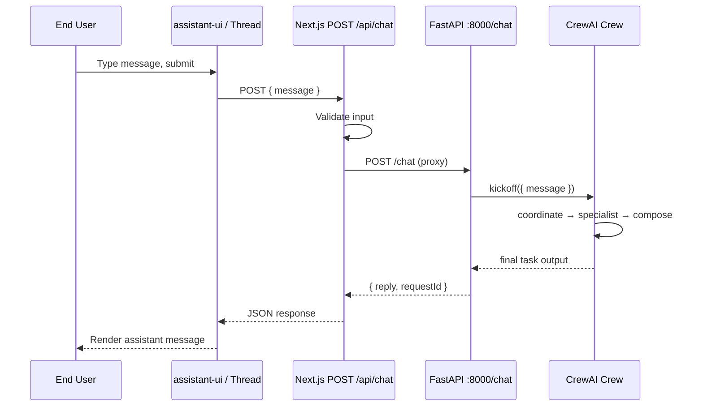
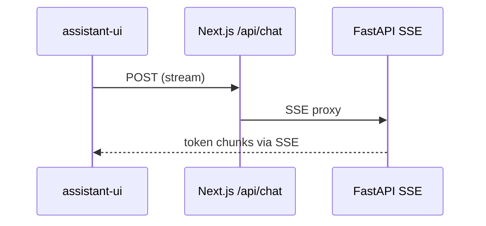

# System Architecture Document (SAD)

**Product**: AAMAD Reference MVP — Multi-Agent Chat Assistant  
**Version**: 1.0.0  
**Status**: Approved for Phase 2 Build  
**Selected Runtime**: `crewai` (`AAMAD_TARGET_RUNTIME=crewai`)  
**Document path**: `project-context/1.define/sad.md`

---

## Document Control

| Field | Value |
| :---- | :---- |
| Author | @system.arch |
| Inputs | PRD v0.1.0, MRD (June 2026), sad-template.md |
| Consumers | @project.mgr, @frontend.eng, @backend.eng, @integration.eng, @qa.eng |
| Standard alignment | ISO/IEC/IEEE 42010 (stakeholders, views, correspondence); SEI Views and Beyond |

---

## Stakeholders and Concerns

| Stakeholder | Concerns | Viewpoints |
| :---------- | :------- | :--------- |
| End user | Reliable chat, clear errors, responsive UI | UX, logical |
| AI Product Builder | Fast MVP, scope control, traceability | Process, deployment |
| Full-Stack Developer | Clear API contracts, local dev ergonomics | Logical, development |
| Backend Developer | CrewAI YAML config, logging, no scope creep | Logical, process |
| Frontend Developer | assistant-ui integration, stubs only (no BE wire) | Logical, UX |
| Integration Engineer | Stable `/api/chat` contract, testable round-trip | Process, deployment |
| QA Engineer | Smoke tests, documented setup | Process |
| Operator / Framework Evaluator | Reproducible artifacts, runtime recorded in Audit | Correspondence |

---

## PRD Traceability Matrix

| PRD ID | SAD Section | Component |
| :----- | :---------- | :-------- |
| F-001 | §3, §6 | assistant-ui Thread + Composer |
| F-002 | §2 | CrewAI sequential crew |
| F-003 | §4, §6 | `POST /api/chat`, FastAPI `/chat` |
| F-004 | §5, §10 | Local dev topology, setup.md |
| F-005 | §3 | UI stub components |
| F-103 (P1) | §6 | SSE streaming upgrade path |
| F-101, F-102 (P1) | §4, §8 | Auth/history deferred |

---

## 1. MVP Architecture Philosophy & Principles

### MVP Design Principles

| Principle | MVP application | Deferred |
| :-------- | :-------------- | :------- |
| **Customer feedback first** | Local runnable chat validates multi-agent value | Production deploy |
| **Modern LLM interface** | assistant-ui + shadcn/ui | Custom tool renderers (P1) |
| **Observable by default** | Console/verbose CrewAI logs | APM, LangSmith (P1+) |
| **Automated deployment** | — | CI/CD, AWS (Phase 3 Deliver) |

**80/20 rule**: Deliver chat round-trip via three-agent CrewAI crew with production-grade UI primitives; defer persistence, auth, analytics, streaming, and cloud ops.

### Core vs. Future Features

| Tier | Capabilities |
| :--- | :----------- |
| **Phase 2 MVP** | Chat UI, `POST /api/chat`, CrewAI crew (coordinator → specialist → composer), local dev, UI stubs, structured errors |
| **Phase 2 P1** | SSE streaming, agent trace panel, custom tools |
| **Phase 3 Deliver** | CI/CD, hosting, auth, persistence, enterprise security, horizontal scale |

### Technical Architecture Decisions

| Decision | Choice | Rationale (PRD/MRD) |
| :------- | :----- | :------------------ |
| Next.js routing | **App Router** (14+) | Server/client split, API routes colocated; PRD §3 |
| Chat UI | **assistant-ui** | Production UX (streaming-ready, a11y); MRD §3 |
| vs custom chat | assistant-ui | Lower integration risk; composable primitives |
| Agent runtime | **CrewAI** sequential | PRD crew pattern; adapter-crewai rules |
| Backend topology | **FastAPI sidecar** + Next.js proxy | Resolves PRD OQ #4; clean Python boundary for @backend.eng |
| Response mode (MVP) | **Blocking JSON** | Simpler integration; PRD F-103 P1; upgrade to SSE documented |
| Database | **None** | PRD §3, backend-eng prohibited-actions |
| Auth | **UI stub only** | PRD F-101 |
| Memory | `memory=False` | Reproducibility per adapter-crewai |

---

## 2. Multi-Agent System Specification

### Agent Architecture (3 agents — PRD §3)

| Agent ID | Role | Goal (summary) | Tools | Memory | Delegation |
| :------- | :--- | :------------- | :---- | :----- | :--------- |
| `coordinator` | Crew Coordinator | Produce execution plan from user message | None | false | false |
| `specialist` | Domain Specialist | Substantive answer per plan | None | false | false |
| `composer` | Response Composer | Format final chat reply | None | false | false |

### Task Orchestration

```
User message
    → coordinate_task (coordinator)
        → specialist_task (specialist) [context: coordinate_task]
            → compose_task (composer) [context: specialist_task]
                → final reply string
```

| Task ID | Agent | expected_output | Context deps |
| :------ | :---- | :-------------- | :----------- |
| `coordinate_task` | coordinator | Structured plan (markdown bullets) | — |
| `specialist_task` | specialist | Substantive analysis/answer | coordinate_task |
| `compose_task` | composer | Single conversational reply (plain text, no code fences) | specialist_task |

### CrewAI Framework Configuration

| Setting | Value | Source |
| :------ | :---- | :----- |
| `process` | `Process.sequential` | PRD §3, adapter-crewai |
| `memory` | `False` | adapter-crewai |
| `verbose` | `True` (dev) | Debugging MVP |
| `max_iter` | `12` (per agent task) | adapter-crewai |
| `max_retry_limit` | `>= 2` | adapter-crewai |
| `allow_delegation` | `false` (all agents) | PRD §3 |
| `max_execution_time` | `120` seconds (crew-level tune) | PRD P95 < 60s target + buffer |

### File layout (backend — @backend.eng)

```
backend/
├── config/
│   ├── agents.yaml      # coordinator, specialist, composer
│   └── tasks.yaml       # coordinate_task, specialist_task, compose_task
├── src/
│   ├── crew.py          # @CrewBase class
│   └── main.py          # FastAPI app + kickoff handler
├── requirements.txt
└── pyproject.toml       # optional
```

### Error handling and retries

- CrewAI `max_retry_limit >= 2` on transient LLM failures.
- FastAPI returns `502` with `{ "error": { "code": "CREW_FAILED", "message": "..." } }` on unhandled crew exceptions.
- Next.js API route maps upstream errors to same JSON shape for UI (PRD F-003).
- Log agent/task lifecycle to stdout; optional trace files under `project-context/2.build/logs/` (adapter-crewai).

### Performance (MVP)

| Constraint | Target |
| :--------- | :----- |
| Concurrent users | 1 (local dev) |
| P95 latency | < 60s (LLM-bound) |
| Token budget | Document in backend.md Audit; no hard guardrail in MVP |

---

## 3. Frontend Architecture Specification (Next.js + assistant-ui)

### Technology Stack

| Layer | Technology |
| :---- | :--------- |
| Framework | Next.js 14+ App Router |
| Language | TypeScript |
| Chat UI | assistant-ui (`@assistant-ui/react`) |
| AI transport (MVP) | Custom fetch to `/api/chat` or `@assistant-ui/react-ai-sdk` with custom transport |
| Components | shadcn/ui |
| Styling | Tailwind CSS |
| Client state | assistant-ui runtime + minimal React state (Zustand optional, not required MVP) |

### Application Structure

```
app/
├── layout.tsx              # Root layout, fonts, theme
├── page.tsx                # Main chat page
├── globals.css
└── api/
    └── chat/
        └── route.ts        # Proxy to FastAPI (integration epic)

components/
├── assistant-ui/
│   ├── thread.tsx
│   └── thread-list.tsx     # stub / disabled for MVP
├── layout/
│   ├── header.tsx          # app title + stub account menu
│   └── sidebar-stub.tsx    # history stub (F-005)
└── stubs/
    ├── auth-stub.tsx
    ├── analytics-stub.tsx
    └── settings-stub.tsx
```

### assistant-ui Integration (MVP)

- **Primary presentation**: Full-page `Thread` + composer on `/`.
- **Runtime**: Blocking request/response; show loading indicator while awaiting JSON reply (PRD F-001).
- **Markdown**: Enable `@assistant-ui/react-markdown` for assistant messages.
- **Streaming (P1)**: Migrate to `useChatRuntime` + SSE when F-103 implemented.
- **Theming**: shadcn default theme; light/dark optional.

### User Interface Requirements

| Requirement | MVP implementation |
| :---------- | :----------------- |
| Chat layout | Centered thread, fixed composer |
| Responsive | Mobile-first Tailwind breakpoints |
| Accessibility | Keyboard submit, focus trap in composer, ARIA on thread |
| Loading | Spinner or "Thinking…" during API call |
| Errors | Inline banner from API `error.message` |
| Stubs | Disabled sidebar, login button labeled "Coming soon" (F-005) |
| Analytics dashboard | Non-functional placeholder panel (F-005) |

### Server vs Client Components

- `page.tsx`: Client component boundary for assistant-ui (`"use client"`).
- `layout.tsx`: Server component for static shell.
- `api/chat/route.ts`: Server-side route handler only.

---

## 4. Backend Architecture Specification

### API Architecture

#### External contract (frontend → Next.js)

**`POST /api/chat`**

Request:
```json
{
  "message": "string (1-8000 chars, trimmed, non-empty)"
}
```

Success `200`:
```json
{
  "reply": "string",
  "requestId": "uuid"
}
```

Error `4xx/5xx`:
```json
{
  "error": {
    "code": "VALIDATION_ERROR | UPSTREAM_UNAVAILABLE | CREW_FAILED | CONFIG_ERROR",
    "message": "human-readable string"
  }
}
```

#### Internal contract (Next.js → FastAPI sidecar)

**`POST http://127.0.0.1:${CREW_API_PORT}/chat`**

Same body/response schema. Next.js route validates input before proxying.

| Code | Condition |
| :--- | :-------- |
| 400 | Empty/invalid message |
| 502 | FastAPI unreachable |
| 500 | Unhandled proxy error |

### FastAPI CrewAI service

| Endpoint | Purpose |
| :------- | :------ |
| `GET /health` | Liveness for QA smoke test |
| `POST /chat` | Accept message, run `crew.kickoff(inputs={"message": ...})`, return `reply` |

**Kickoff inputs**: `{ "message": "<user text>" }` interpolated into task descriptions via YAML `{message}` placeholders.

### Database Architecture

**MVP: None.** No Prisma, SQLite, or conversation store (PRD §3, backend-eng).

**Future path (P1 F-102)**: SQLite dev → PostgreSQL prod; schema for `conversations`, `messages` documented in Phase 3 SAD revision.

### CrewAI Integration Layer

- Python 3.10+ virtualenv (or uv) isolated from Node.
- LLM via env-configured provider (OpenAI default; Anthropic supported via env switch).
- No custom tools in MVP.
- Configuration hot-reload not required; restart service on YAML change.

### Authentication & Security (MVP)

| Control | MVP |
| :------ | :-- |
| User auth | Stub UI only |
| API keys | `OPENAI_API_KEY` / `ANTHROPIC_API_KEY` in `.env` |
| Input validation | Max length, trim, reject empty |
| Output sanitization | React markdown rendering; no `dangerouslySetInnerHTML` for raw HTML |
| CORS | FastAPI allows `localhost:3000` only |
| Rate limiting | Not required (single local user) |
| Secrets in repo | Prohibited |

### Environment Variables

| Variable | Required | Description |
| :------- | :------- | :---------- |
| `OPENAI_API_KEY` | One of LLM keys | OpenAI API key |
| `ANTHROPIC_API_KEY` | One of LLM keys | Anthropic API key |
| `LLM_PROVIDER` | Yes | `openai` \| `anthropic` |
| `LLM_MODEL` | Yes | e.g. `gpt-4o-mini`, `claude-sonnet-4-20250514` |
| `CREW_API_PORT` | No (default 8000) | FastAPI bind port |
| `CREW_API_URL` | No | Override full URL for Next proxy |
| `AAMAD_TARGET_RUNTIME` | Yes | `crewai` |

---

## 5. DevOps & Deployment Architecture

### Phase 2 MVP (in scope)

| Item | Specification |
| :--- | :------------ |
| Hosting | Local only: `npm run dev` (port 3000) + `uvicorn` (port 8000) |
| Process model | Two terminals or `concurrently` script in setup.md |
| Health check | `GET http://127.0.0.1:8000/health` |
| Build | `next build` optional for QA; dev mode primary |
| Env files | `.env.example` at repo root; never commit `.env` |

### Phase 3 Deliver (deferred — template §5)

| Item | Status |
| :--- | :----- |
| GitHub Actions CI/CD | Deferred |
| AWS App Runner | Deferred |
| Terraform / IaC | Deferred |
| Blue-green deploy | Deferred |
| Staging/prod separation | Deferred |

### Monitoring & Observability (MVP)

- **Logs**: stdout from Next.js and FastAPI; CrewAI `verbose=True`.
- **Metrics**: None.
- **Tracing**: Optional manual logs in `project-context/2.build/logs/`.
- **Alerting**: None.

---

## 6. Data Flow & Integration Architecture

### Request/Response Flow (MVP — blocking)



### Streaming upgrade path (P1 — F-103)



Implement when P1 prioritized; MVP uses blocking flow above.

### External Integrations

**MVP: None** (PRD §3). Tool stubs commented in `backend/src/crew.py` for P1 F-104.

### Analytics & Feedback

**MVP: UI stub only.** No event pipeline (PRD F-005, F-203).

---

## 7. Performance & Scalability Specifications

### Performance Requirements (MVP)

| Operation | Target |
| :-------- | :----- |
| UI interaction | < 100ms (local) |
| API proxy overhead | < 50ms excluding crew |
| Crew execution | < 60s P95 (LLM-dependent) |
| Cold start (Python) | Acceptable on first request |

### Scalability (deferred)

- No load balancing, auto-scaling, or CDN for MVP.
- Future: horizontal scale FastAPI workers; Redis queue for crew jobs; read replicas when persistence added.

### Resource Optimization

- Use cost-efficient default model in `.env.example` (e.g. `gpt-4o-mini`).
- Document token usage in backend.md; no automatic budgeting in MVP.

---

## 8. Security & Compliance Architecture

### Security Framework (MVP)

| Area | Implementation |
| :--- | :------------- |
| Transport | localhost HTTP only (dev) |
| Secrets | Env vars; redact in logs |
| Input validation | Next.js + FastAPI pydantic models |
| Dependency scanning | Recommended manual; not automated in MVP |
| Incident response | Out of scope |

### Data Privacy & Compliance

- No PII stored (PRD §5).
- GDPR/SOC2: Phase 3 hardening.
- Audit: build artifacts include Audit sections per aamad-core.

---

## 9. Testing & Quality Assurance Specifications

### Testing Strategy (MVP)

| Level | Scope | Owner |
| :---- | :---- | :---- |
| Smoke | `GET /health`, `POST /api/chat` happy path | @qa.eng |
| Manual | UI submit, error states (missing API key) | @qa.eng |
| Integration | Full round-trip after @integration.eng | @qa.eng |
| Unit | Optional; not required MVP | — |
| E2E Playwright | Deferred P1 | — |
| Load test | Deferred | — |

### Quality Gates

| Gate | Criteria |
| :--- | :------- |
| Phase 2 complete | CHECKLIST Step 6 local launch works |
| Scope | No functional auth/DB/analytics |
| Artifacts | setup.md, frontend.md, backend.md, integration.md, qa.md present |
| Runtime | `AAMAD_TARGET_RUNTIME=crewai` in Audit |

### Accessibility

- Manual keyboard navigation check on chat composer and thread (PRD §6).

---

## 10. MVP Launch & Feedback Strategy

### Beta Testing (local)

| Item | Plan |
| :--- | :--- |
| Audience | AAMAD operators, framework evaluators |
| Scenarios | Valid prompt, empty submit, backend down, missing API key |
| Success | qa.md smoke pass |
| Feedback | GitHub issues + artifact Open Questions |

### Welcome message (resolves PRD OQ #5)

Display static assistant welcome on first load:

> "Welcome to the AAMAD Reference MVP. Ask any question — a team of AI agents will coordinate, research, and compose a reply."

### Business Metrics

Tracked qualitatively per PRD §7; no in-app analytics in MVP.

---

## Logical View (Element Catalog)

| Element | Responsibility |
| :------ | :------------- |
| `ChatPage` | Renders Thread, handles client runtime |
| `ChatApiRoute` | Validation, proxy, error mapping |
| `CrewApiService` | FastAPI, crew kickoff |
| `ReferenceCrew` | CrewAI @CrewBase orchestration |
| `agents.yaml` / `tasks.yaml` | Declarative agent/task config |
| `StubPanels` | Non-functional roadmap UI |

---

## Deployment View (MVP)

```
┌─────────────────────────────────────────────┐
│  Developer machine (localhost)              │
│                                             │
│  ┌──────────────┐      ┌─────────────────┐  │
│  │ Next.js :3000│─────▶│ FastAPI :8000   │  │
│  │ (browser UI) │ HTTP │ (CrewAI crew)   │  │
│  └──────────────┘      └────────┬────────┘  │
│                                 │           │
│                                 ▼           │
│                        ┌─────────────────┐  │
│                        │ LLM Provider API│  │
│                        │ (OpenAI/Anthropic)│
│                        └─────────────────┘  │
└─────────────────────────────────────────────┘
```

---

## Correspondence Rules

| From | To | Rule |
| :--- | :- | :--- |
| PRD F-00x | SAD §2–§6 | Every P0 feature maps to ≥1 component |
| SAD API schema | integration.md | Must match at handoff |
| agents.yaml | PRD §3 agent defs | IDs and roles align |
| adapter-crewai | backend implementation | YAML externalization, sequential, memory=false |

---

## Architectural Decisions Record (ADR)

| ID | Decision | Alternatives rejected | Status |
| :- | :------- | :-------------------- | :----- |
| ADR-001 | FastAPI sidecar for CrewAI | Subprocess-per-request; embedded Python in Next | **Accepted** |
| ADR-002 | Blocking JSON for MVP chat | SSE streaming | **Accepted** (SSE → P1) |
| ADR-003 | No database MVP | SQLite conversations | **Rejected** for MVP (PRD) |
| ADR-004 | assistant-ui over custom UI | Raw AI SDK only | **Accepted** (MRD) |
| ADR-005 | Sequential 3-agent crew | Parallel; hierarchical delegation | **Accepted** (PRD) |
| ADR-006 | OpenAI default LLM provider | Anthropic-only | **Accepted** with env switch |

---

## Implementation Guidance for Build Personas

### Phase 2 Development Priorities

1. **@project.mgr**: Monorepo layout, Node + Python venv, `.env.example`, start scripts → `setup.md`
2. **@frontend.eng**: Next.js + assistant-ui + stubs → `frontend.md` (no API wire)
3. **@backend.eng**: FastAPI + CrewAI YAML crew + `/chat` → `backend.md`
4. **@integration.eng**: Wire `/api/chat` proxy, verify round-trip → `integration.md`
5. **@qa.eng**: Smoke tests per §9 → `qa.md`

### Critical implementation notes

- Use Server Actions **only** if simpler than route handler; default to `app/api/chat/route.ts`.
- TypeScript types shared in `lib/api-types.ts` for request/response.
- Python pydantic models mirror JSON schema.
- Do not implement Prisma, NextAuth, or GitHub Actions in Phase 2.

### MVP Scope Boundaries (explicit exclusions)

- Content marketing workflow (template boilerplate — **not** this product)
- Single-user session without auth (by design)
- SQLite/PostgreSQL
- AWS App Runner / Terraform
- Enterprise SSO, multi-tenant
- Agent trace UI (P1 F-105)

---

## Architecture Validation Checklist

- [x] All PRD P0 requirements mapped to architectural components
- [x] CrewAI agents match PRD coordinator / specialist / composer
- [x] assistant-ui supports required chat interaction (blocking MVP)
- [x] Next.js App Router structure defined
- [x] Database excluded per PRD; future path noted
- [x] API design with structured errors (PRD F-003)
- [x] MVP security appropriate; enterprise upgrade deferred
- [x] CI/CD deferred to Phase 3 with rationale
- [x] Monitoring minimal; logs sufficient for MVP
- [x] Path to MVP → production documented

---

## Sources

- `project-context/1.define/PRD.md` v0.1.0 — functional and technical requirements
- `project-context/1.define/MRD.md` — feasibility, assistant-ui/CrewAI validation
- `.cursor/templates/sad-template.md` — document structure
- `.cursor/rules/adapter-crewai.mdc` — runtime execution constraints
- `.cursor/rules/adapter-registry.mdc` — `AAMAD_TARGET_RUNTIME`
- `.cursor/agents/backend-eng.md` — MVP backend prohibitions
- `.cursor/agents/frontend-eng.md` — FE/integration boundary
- CrewAI Documentation — Agents, Tasks, Crews (docs.crewai.com, 2025–2026)
- assistant-ui Documentation (assistant-ui.com/docs, 2026)
- AAMAD `CHECKLIST.md` — Phase 2 sequence

---

## Assumptions

1. **`AAMAD_TARGET_RUNTIME=crewai`** unless operator overrides before @project.mgr setup.
2. **LLM default**: OpenAI `gpt-4o-mini` in `.env.example` for cost-efficient local dev.
3. **Two-process local dev** is acceptable (Next + FastAPI).
4. No `user-stories/*.md` inputs existed; traceability uses PRD feature IDs.
5. Persona input paths (`product-requirements-document.md`) resolve to `PRD.md`.
6. Full SAD template sections for Phase 3/cloud are included as **explicit deferrals**, not active requirements.

---

## Open Questions

1. Confirm **LLM provider** for team standard (OpenAI vs Anthropic default in setup).
2. Should **concurrently** npm script start both services, or document two terminals only?
3. Domain customization of **specialist** agent before backend epic?
4. Prioritize **F-103 streaming** immediately after MVP smoke pass?

---

## Audit

| Timestamp | Persona | Action |
| :-------- | :------ | :----- |
| 2026-06-15T18:00:00Z | @system.arch | Created SAD v1.0.0 at `project-context/1.define/sad.md` |
| 2026-06-15T18:00:00Z | @system.arch | Resolved runtime: `AAMAD_TARGET_RUNTIME=crewai` |
| 2026-06-15T18:00:00Z | @system.arch | ADR-001: FastAPI sidecar; ADR-002: blocking JSON MVP |
| 2026-06-15T18:00:00Z | @system.arch | Deferred DB, auth, CI/CD, cloud per PRD MVP scope |

**Prompt Trace**: Omitted — architecture synthesis from Phase 1 artifacts; no runtime execution.

**Tool usage**: Read PRD, MRD, templates, adapter rules; write SAD.
